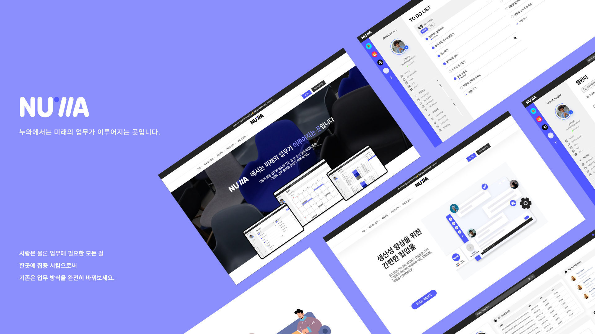
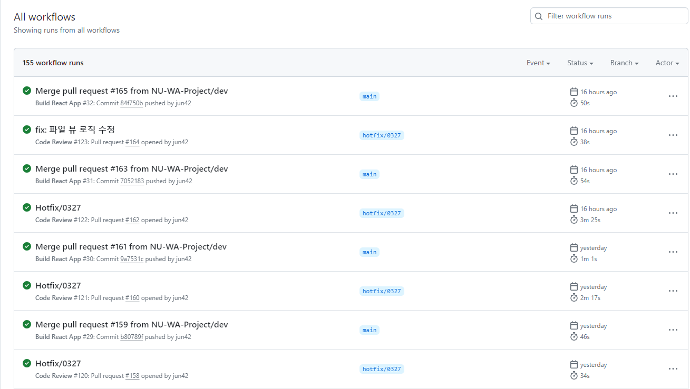
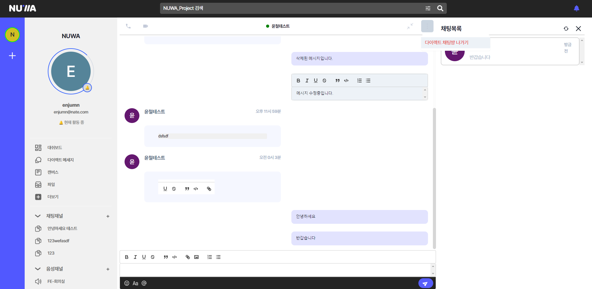
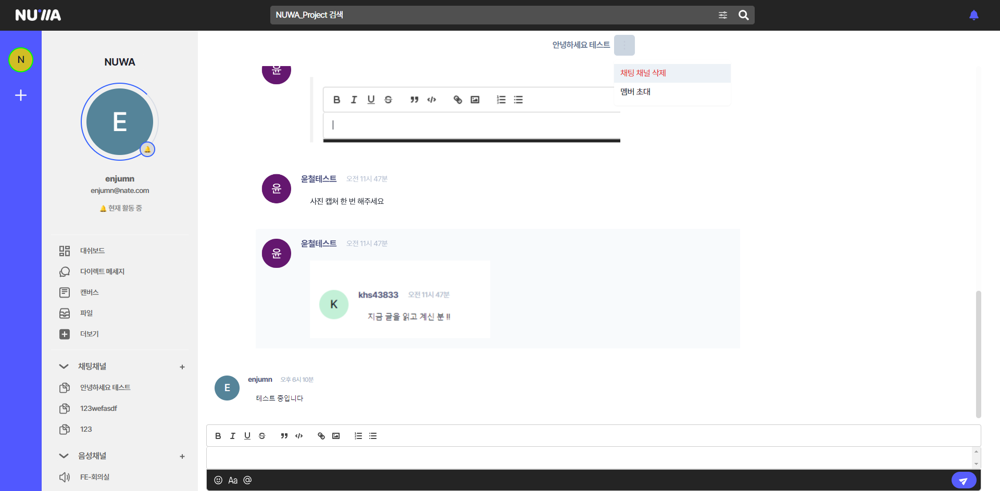
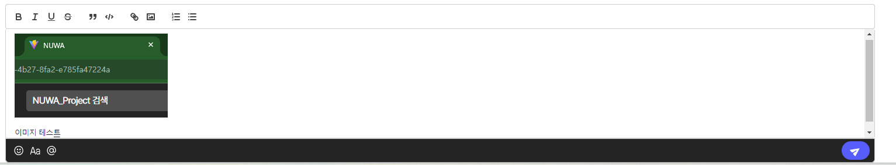
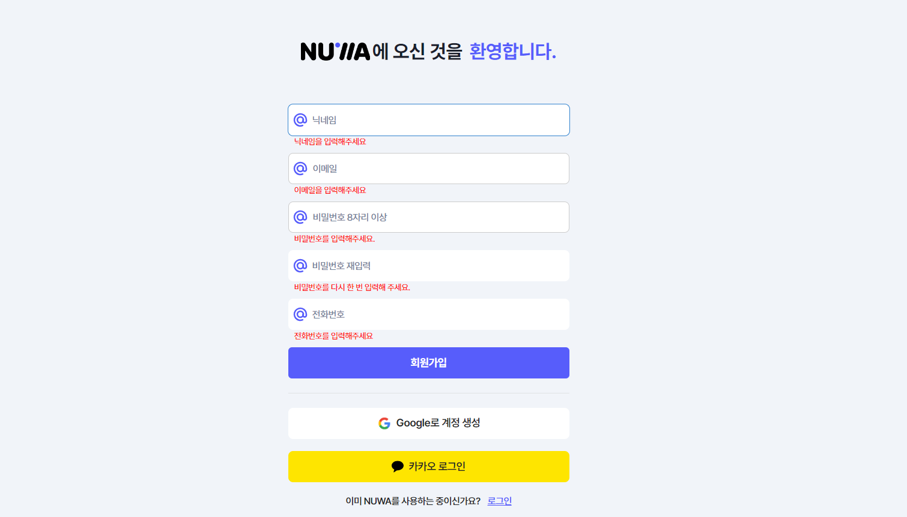

# NUWA

### 팀 프로젝트 개요:

####

직접 써볼 수 있는 프로그램을 만들어보자는 취지에서 슬랙, 디스코드 같은 채팅 앱을 레퍼런스로 하여 채팅앱을 만들어봤습니다.

### Link: https://nu-wa.online/

#### 팀 구성 : 백엔드 2명, 프론트엔드 5명, 디자이너 1명

### 프론트엔드 기술 스택

담당:

1.  프로젝트에서 프론트엔드 리드를 맡았습니다.

    - 백엔드와의 소통, 프론트엔드 진행 전반 담당
    - github 관리 ( pr template 등)
    - github actions를 사용하여 gpt code review bot 도입
    - github actions를 사용하여 CI/CD 진행 (AWS S3, CloutFront, Route53)

    

###

2.  채팅 구현
    - Stomp와 Sock을 사용하여 소켓을 통한 채팅 전송, 수정, 삭제 구현
    - useInfiniteQuery를 사용하여 이전 채팅 더보기를 구현
    - 
      

###

3.  quill WYSIWYG에디터 - react-quill이 제어컴포넌트로 렌더링 이슈가 우려되었고 클래스형 컴포넌트로 러닝커브가 필요할 것 같아서 quill을 직접 사용하여 비제어컴포넌트로 사용 - 툴바 디자인이 달라서 수정이 필요했는데 시간 절감을 위해 snow 테마를 커스텀해서 사용 - 이미지 업로드시 소켓으로 바로 전송하면 소켓에 부담이 커지기 때문에 클립보드 모듈, 툴바 모듈을 커스텀하여 s3에 업로드 후 경로를 전송
    

###

4.  로그인 회원가입 폼 구현, 토큰 관리,

    - 로그인, 회원가입 폼을 react-hook-form으로 구현

    - 소셜로그인 링크를 받아서 토큰을 받아오는 플로우를 구현
    - 초대 링크로 워크스페이스에 가입하는 플로우 구현
    - 앱 상단에서 authProvide를 구현해서 토큰 재발급 등 토큰 관리를 구현

 5. 그 외 UI 구현 , UI깨짐 수정, 글로벌 스타일, theme 세팅.
